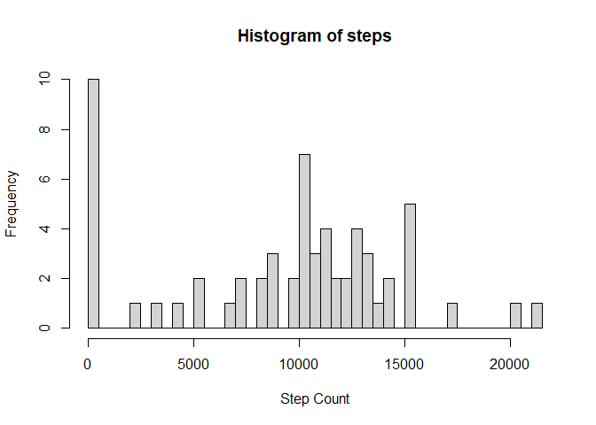
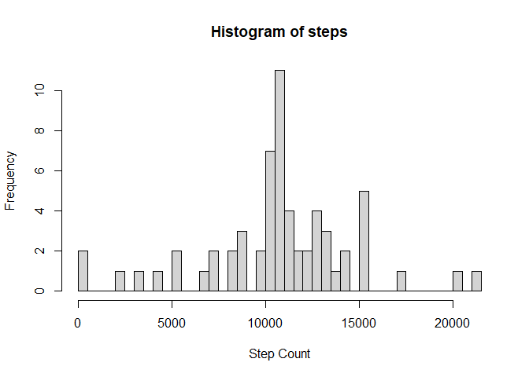
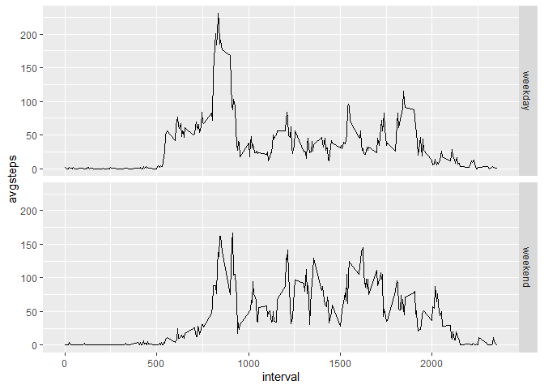

## Loading and preprocessing the data

```r
if (!file.exists("data.zip")){
  url <- "https://d396qusza40orc.cloudfront.net/repdata%2Fdata%2Factivity.zip"
  download.file(url, destfile = "data.zip", method = "curl")
  unzip("data.zip")
}
activity <- read.csv("activity.csv")
```
Now we want to get some sense of the Data and its dimensions

```r
str(activity)
```

```
## 'data.frame':	17568 obs. of  3 variables:
##  $ steps   : int  NA NA NA NA NA NA NA NA NA NA ...
##  $ date    : chr  "2012-10-01" "2012-10-01" "2012-10-01" "2012-10-01" ...
##  $ interval: int  0 5 10 15 20 25 30 35 40 45 ...
```
*It's clear that the data doesn't need further processing for now*

## What is mean total number of steps taken per day?
First off we need to make a histogram of the sum of steps for each day

```r
hist1 <- with(activity, tapply(activity$steps, date, sum, na.rm = TRUE))
hist(hist1, breaks = 61, main = "Histogram of steps", xlab = "Step Count")
```

<!-- -->

Now we have to calculate two things:

1. Steps mean/day

2. Steps median/day


```r
activitymean <- mean(hist1)
activitymean
```

```
## [1] 9354.23
```

```r
activitymedian <- median(hist1)
activitymedian
```

```
## [1] 10395
```
## What is the average daily activity pattern?
Now we should get the average steps for each interval of time across days 

```r
intervalmean <- as.data.frame(with(activity, tapply(activity$steps, interval, 
                                                     mean, na.rm = TRUE)))
intervalsteps <- data.frame(interval = unique(activity$interval), steps = intervalmean[,1])
plot(intervalsteps, type = "l")
```

<!-- -->

**The maximum steps for a 5 minute interval is as follows:**

```r
max(intervalsteps$steps)
```

```
## [1] 206.1698
```
## Imputing missing values
Now we should do some work on the missing values in this data set.
We're going to do this through several steps:

1. Identify the number of missing values denoted by NA

2. Replace those missing values with the average of this interval

3. Create a new dataset that is equal to the original dataset but with the missing data filled in


```r
number <- sum(is.na(activity[,1]))
number
```

```
## [1] 2304
```

```r
##now replacing the na values##
NAs <- which(is.na(activity[,1]))
for (i in 1:nrow(activity)) {
    if (i %in% NAs){
      activity[i,1] <- intervalsteps$steps[intervalsteps$interval==activity[i,3]]
  }
} 
```
**Now we draw the histogram with the new data**

```r
hist2 <- with(activity, tapply(activity$steps, date, sum))
hist(hist2, breaks = 61, main = "Histogram of steps", xlab = "Step Count")
```

<!-- -->

**After that we calculate the mean and median**

```r
activitymean <- mean(hist2)
activitymean
```

```
## [1] 10766.19
```

```r
activitymedian <- median(hist2)
activitymedian
```

```
## [1] 10766.19
```
We can notice that the mean and median have the same values and they're different
than the values calculated earlier

## Are there differences in activity patterns between weekdays and weekends?
Firstly, we have to convert the 2nd column of activity from class character to date to be able to work with this column properly and use weekdays function

```r
activity[,2] <- as.Date(strptime(activity$date, format = "%Y-%m-%d"))
activity$day <- weekdays(activity$date) ###here we are creating a new column###
for (i in 1:nrow(activity)){
  if (activity[i,4] %in% c("Saturday","Sunday")){
    activity[i,]$day <- "weekend"
  }
  else {
    activity[i,]$day <- "weekday"
  }
}
str(activity)
```

```
## 'data.frame':	17568 obs. of  4 variables:
##  $ steps   : num  1.717 0.3396 0.1321 0.1509 0.0755 ...
##  $ date    : Date, format: "2012-10-01" "2012-10-01" ...
##  $ interval: int  0 5 10 15 20 25 30 35 40 45 ...
##  $ day     : chr  "weekday" "weekday" "weekday" "weekday" ...
```

```r
##Now we will change the "day" variable from character to factor variable##
activity$day <- as.factor(activity$day)
str(activity)
```

```
## 'data.frame':	17568 obs. of  4 variables:
##  $ steps   : num  1.717 0.3396 0.1321 0.1509 0.0755 ...
##  $ date    : Date, format: "2012-10-01" "2012-10-01" ...
##  $ interval: int  0 5 10 15 20 25 30 35 40 45 ...
##  $ day     : Factor w/ 2 levels "weekday","weekend": 1 1 1 1 1 1 1 1 1 1 ...
```

*Now we move to the next step which is ploting the average of intervals for weekdays and weekends*


```r
library(ggplot2)
```

```
## Warning: package 'ggplot2' was built under R version 4.1.3
```

```r
stepsbyday <- with(activity, aggregate(activity$steps, list(interval, day),mean))
colnames(stepsbyday) <- c("interval", "day", "avgsteps")
head(stepsbyday)
```

```
##   interval     day   avgsteps
## 1        0 weekday 2.25115304
## 2        5 weekday 0.44528302
## 3       10 weekday 0.17316562
## 4       15 weekday 0.19790356
## 5       20 weekday 0.09895178
## 6       25 weekday 1.59035639
```

```r
g <- ggplot(stepsbyday, aes(interval,avgsteps))
g+geom_line()+facet_grid(day~.)
```

<!-- -->

**THE END**
